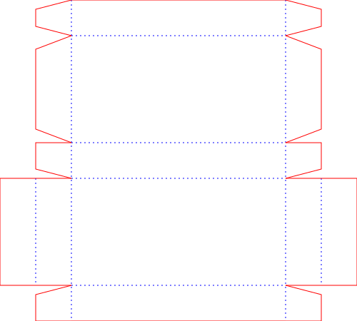

# Foldable box generator
Enter x, y, z params, get an SVG to cut out and fold into the box.

You can get something like this:

Only generates rectangle boxes.

Requirements:
- python3
- [drawSVG](https://pypi.org/project/drawsvg/) library
